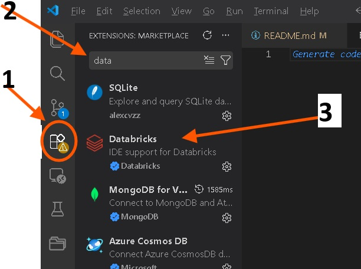
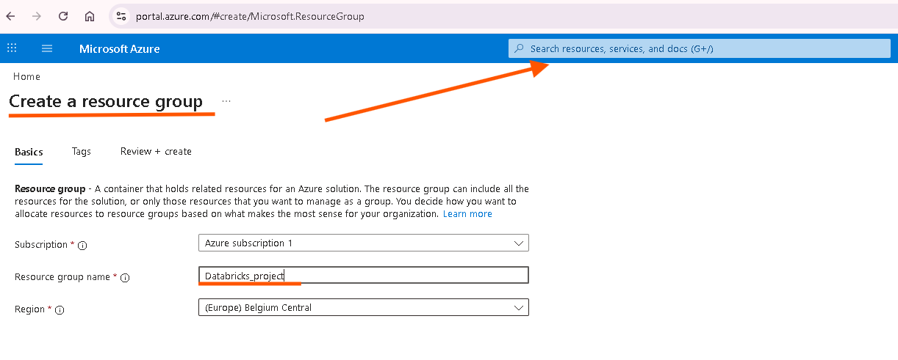
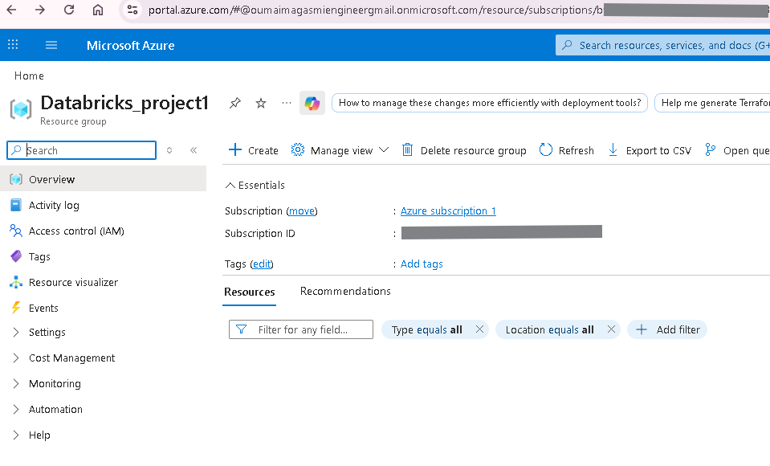

# 🚀 Azure Databricks: Incremental Data Mastery Lab

## 🏗️ Project Architecture
This diagram outlines the end-to-end flow from raw data ingestion to Power BI reporting.

---

## 📋 Prerequisites
Before you begin, ensure you have:
* An active **Azure Account**.
* **VS Code** installed with the Azure & Databricks extensions.
  
* A created **Databricks Workspace**.

---

## 🛠️ Step 1: Azure Environment Setup

### 1. Resource Group Creation
Log in to the [Azure Portal](https://portal.azure.com) and create a **Resource Group** named `Databricks_project1`. 

| Action | Visual Reference |
| :--- | :--- |
| **Defining the Group** |  |
| **Successful Deployment** |  |

### 2. Storage Configuration
Deploy a **Storage Account (ADLS Gen2)** with "Hierarchical Namespace" enabled. This acts as our Bronze, Silver, and Gold storage layers.