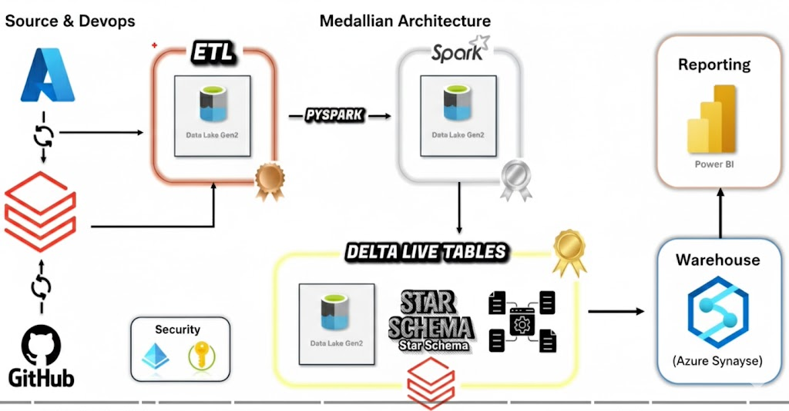

# 🚀 Azure Databricks: Incremental Data Mastery Lab

## 📋 Prerequisites
Before you begin, ensure you have:
* An active **Azure Account**.
* **VS Code** installed with the Azure & Databricks extensions.
* A created **Databricks Workspace** (Premium Tier).

## 🛠️ Step 1: Azure Environment Setup
1. Log in to the [Azure Portal](https://portal.azure.com).
2. Create a **Resource Group** named `rg-databricks-lab`.
3. Deploy a **Storage Account (ADLS Gen2)** with "Hierarchical Namespace" enabled.

## 🏗️ Project Architecture

